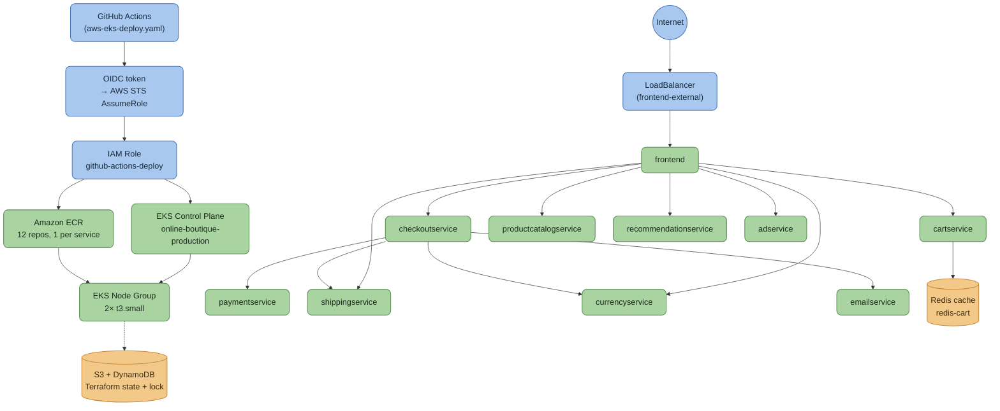
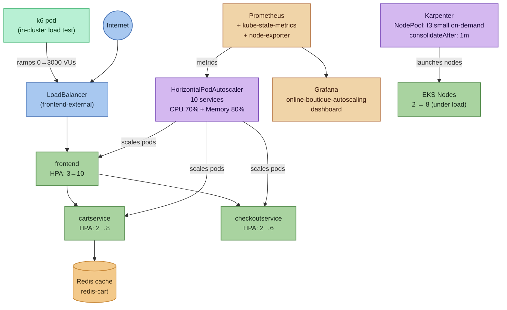
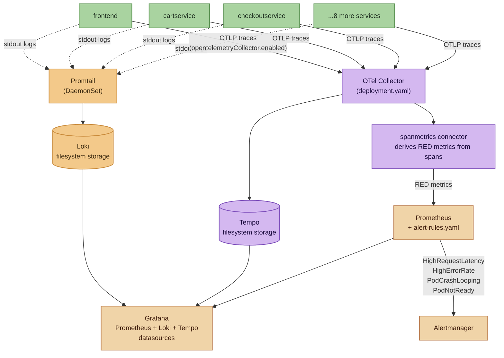
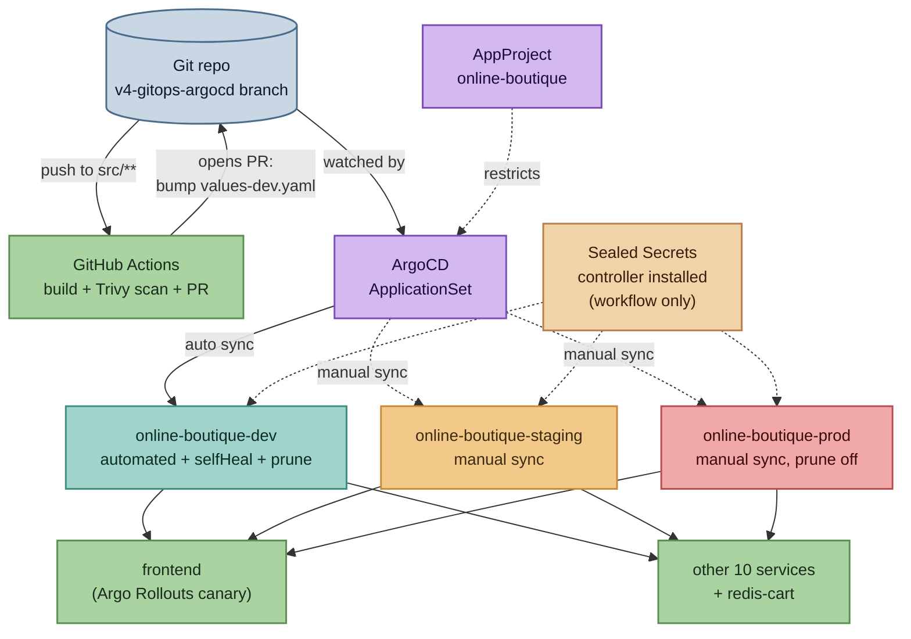

# Online Boutique — Production AWS EKS Deployment

> A production-grade AWS DevOps layer (Terraform, EKS, ECR, Helm, GitHub Actions OIDC CI/CD) built on top of Google's Online Boutique microservices demo.


---

## Table of Contents

- [Project Description](#project-description)
- [Video Series](#video-series)
- [Attribution](#attribution)
- [V1 Architecture](#architecture)
- [Tech Stack](#tech-stack)
- [Microservices](#microservices)
- [V1 — EKS Deployment](#v1--eks-deployment)
- [Prerequisites](#prerequisites)
- [How to Deploy](#how-to-deploy)
- [Project Structure (AWS layer)](#project-structure-aws-layer)
- [V2 — Load Testing + Autoscaling](#v2--load-testing--autoscaling)
- [V2 Architecture](#v2-architecture)
- [V3 — SRE / Observability + Incident Response](#v3--sre--observability--incident-response)
- [V3 Architecture](#v3-architecture)
- [V4 — GitOps with ArgoCD](#v4--gitops-with-argocd)
- [V4 Architecture](#v4-architecture)
- [Cost Notes](#cost-notes)
- [What This Teaches](#what-this-teaches)
- [Challenges](#challenges)
- [Cleanup](#cleanup)
- [Command Reference](#command-reference)
- [GCP Path (original, untouched)](#gcp-path-original-untouched)

---

## Project Description

This repo takes Google's **Online Boutique** — an 11-service gRPC microservices e-commerce demo in Go, C#, Node.js, Python, and Java — and adds a full production AWS deployment layer around it, without touching a single line of application code.

Everything under `terraform-aws/`, `addons/`, `kubernetes-manifests-aws/`, `helm-chart/values-aws-production.yaml`, and `.github/workflows/aws-eks-deploy.yaml` is new, purpose-built infrastructure-as-code. The original GCP/GKE deployment assets (`terraform/`, `kubernetes-manifests/`, `helm-chart/templates/`) ship unmodified alongside it, so both cloud targets coexist in the same repo.

Built and verified end-to-end on a real AWS account: VPC → EKS cluster → ECR → Helm release → 11/11 pods `Running`, reachable via a live frontend URL (plain Kubernetes `LoadBalancer` Service — no ALB Ingress installed this run, see [Architecture](#architecture)).

---

## Video Series

| Part | Tag | Video | Focus |
|---|---|---|---|
| V1 | [`v1.0-eks-deployment`](https://github.com/ThinkWithOps/thinkwithops-online-boutique-production/releases/tag/v1.0-eks-deployment) | [Watch](https://youtu.be/qjnJab8mqcI) | VPC → EKS → ECR → Helm, GitHub Actions OIDC CI/CD, first live deploy |
| V2 | [`v2.0-load-testing-autoscaling`](https://github.com/ThinkWithOps/thinkwithops-online-boutique-production/releases/tag/v2.0-load-testing-autoscaling) | [Watch](https://youtu.be/mjGCdLFqZ7k) | HPA, Karpenter node autoscaling, k6 load testing, Prometheus/Grafana observability |
| V3 | [`v3.0-sre-observability`](https://github.com/ThinkWithOps/thinkwithops-online-boutique-production/releases/tag/v3.0-sre-observability) | Coming soon | Loki/Promtail logging, Tempo tracing, Prometheus alert rules, Alertmanager + Slack, runbooks, incident debug scripts — local minikube |
| V4 | [`v4.0-gitops-argocd`](https://github.com/ThinkWithOps/thinkwithops-online-boutique-production/tree/v4.0-gitops-argocd) | Coming soon | ArgoCD ApplicationSet across 3 namespaces, Sealed Secrets pattern, Argo Rollouts canary, GitOps CI, drift/rollback proof — local minikube v1.30 profile |

---

## Attribution

The application source (`src/*`) and the original GCP/GKE deployment assets are from Google's [**GoogleCloudPlatform/microservices-demo**](https://github.com/GoogleCloudPlatform/microservices-demo) ("Online Boutique"), licensed under [Apache License 2.0](LICENSE). No application code was modified to build this AWS layer.

Only the DevOps/infrastructure layer described in this README is original work added on top.

---

## V1 — EKS Deployment

VPC → EKS cluster → ECR → Helm release → GitHub Actions OIDC CI/CD. First live deploy, tagged [`v1.0-eks-deployment`](https://github.com/ThinkWithOps/thinkwithops-online-boutique-production/releases/tag/v1.0-eks-deployment) (see [Video Series](#video-series)).

## Architecture



### How this flows

**Deploy path (blue nodes):** a push to `main` triggers GitHub Actions (`aws-eks-deploy.yaml`), which requests a short-lived OIDC token and exchanges it with AWS STS for temporary credentials — no stored AWS keys anywhere in GitHub Secrets. Those credentials assume the `github-actions-deploy` IAM role, which is scoped to two things: pushing built images to ECR, and deploying to the EKS control plane.

**Traffic path (green nodes):** a request hits the `frontend-external` LoadBalancer — a plain Kubernetes `LoadBalancer` Service, not an ALB Ingress (the ALB controller add-on is provisioned but not installed this run) — and lands on the `frontend` pod. From there: `frontend` fans out to `cartservice` (which reads/writes the Redis cache), `checkoutservice` (which itself calls `paymentservice`, `shippingservice`, `currencyservice`, and `emailservice` to complete an order), plus direct calls to `productcatalogservice`, `recommendationservice`, and `adservice`.

**Compute + registry (green nodes, background):** the EKS node group (2× `t3.small`) is what actually runs all 11 pods — the control plane only makes scheduling decisions, it doesn't host workloads itself. Every image running on those nodes was pulled from one of the 12 ECR repositories, one per service.

**State (amber nodes):** Terraform's own state — the record of what it created — lives in S3 with a DynamoDB lock table, so two people can't `apply` at the same time and corrupt it. This is provisioned by a separate one-time `bootstrap/` step before the main infrastructure apply can even run.

---

## Tech Stack

| Technology | Role |
|---|---|
| Terraform (>= 1.6, `hashicorp/aws` ~> 5.0) | VPC, EKS, ECR, IAM/IRSA, S3+DynamoDB remote state |
| Amazon EKS (1.30) | Managed Kubernetes control plane, `online-boutique-production` |
| Amazon ECR | 12 private image repos, one per microservice, lifecycle policies |
| Amazon VPC | 3-AZ public/private subnets, NAT gateway, IGW |
| IAM Roles for Service Accounts (IRSA) | Scoped AWS access per Kubernetes ServiceAccount, no node-wide IAM |
| GitHub Actions + OIDC | Build/push/deploy pipeline, no long-lived AWS keys in CI |
| Helm 3 | Chart-based deploy, `values-aws-production.yaml` overlay on the existing chart |
| Docker (multi-stage) | Per-service builds, existing Dockerfiles reused as-is |
| aws-load-balancer-controller / ExternalDNS / Cluster Autoscaler | Optional add-ons for ALB ingress, Route53 automation, node autoscaling |
| HorizontalPodAutoscaler + metrics-server (V2) | Pod-level autoscaling on CPU/memory for 10 services |
| Karpenter (V2) | Node-level autoscaling — on-demand `t3.small` provisioning + consolidation |
| k6 (V2) | In-cluster load test, ramping virtual users |
| Prometheus + kube-state-metrics + node-exporter (V2) | Metrics scraping for pods, cluster state, and nodes |
| OpenTelemetry Collector (V2) | Telemetry pipeline feeding Prometheus |
| Grafana (V2 dashboard, V3 datasources) | `online-boutique-autoscaling` dashboard (V2); wired to Prometheus + Loki + Tempo datasources for logs/traces/metrics in one place (V3) |
| Loki + Promtail (V3) | Centralized logging for all 11 services, filesystem storage, no object-store dependency |
| Grafana Tempo (V3) | Distributed tracing, single-binary/local storage |
| OTel Collector `spanmetrics` connector (V3) | Derives real RED (rate/error/duration) metrics from trace spans — the app has no native ones |
| Prometheus Alertmanager + Slack (V3) | Alert routing — latency, error-rate, and pod-crash rules, Slack webhook receiver |
| Minikube (V3 target) | Local single-node cluster — no AWS/cloud dependency for this layer |
| ArgoCD + ApplicationSet (V4) | GitOps controller, one AppProject + ApplicationSet generating dev/staging/prod Applications |
| Argo Rollouts (V4) | Canary strategy for `frontend`, replica-weighted (no service mesh installed) |
| Sealed Secrets (V4) | Controller plus generic workflow for future secrets; no real payload is required or committed |
| Trivy (V4) | Container image vulnerability scan, blocks CI on CRITICAL/HIGH |

---

## Microservices

| Service | Language |
|---|---|
| frontend | Go |
| cartservice | C# |
| productcatalogservice | Go |
| currencyservice | Node.js |
| paymentservice | Node.js |
| shippingservice | Go |
| emailservice | Python |
| checkoutservice | Go |
| recommendationservice | Python |
| adservice | Java |
| loadgenerator | Python/Locust |
| shoppingassistantservice | Python (optional, Gemini-powered) |

All communicate over gRPC; contracts live in `protos/`.

---

## Prerequisites

- AWS account with permissions to create VPC/EKS/IAM/ECR/S3/DynamoDB resources
- [Terraform](https://developer.hashicorp.com/terraform) >= 1.6
- [AWS CLI](https://aws.amazon.com/cli/) v2, configured
- [kubectl](https://kubernetes.io/docs/tasks/tools/) >= 1.30
- [Helm](https://helm.sh/) >= 3.15
- [Docker](https://www.docker.com/) for building/pushing images
- A GitHub repo with OIDC federation (default on github.com) if using the CI workflow

---

## How to Deploy

**1. Bootstrap the Terraform state backend (one time)**
```bash
cd terraform-aws/bootstrap
terraform init
terraform apply
terraform output   # note state_bucket / lock_table, copy into ../backend.tf
```

**2. Provision VPC, EKS, ECR, IAM/IRSA**
```bash
cd terraform-aws
cp terraform.tfvars.example terraform.tfvars
# edit: aws_account_id, github_repository, node sizing
terraform init
terraform plan -out=tfplan
terraform apply "tfplan"
```

**3. Point kubectl at the cluster**
```bash
aws eks update-kubeconfig --region us-east-1 --name online-boutique-production
kubectl get nodes
```

**4. Build and push all 12 images to ECR**
```bash
aws ecr get-login-password --region us-east-1 | \
  docker login --username AWS --password-stdin <AWS_ACCOUNT_ID>.dkr.ecr.us-east-1.amazonaws.com

for svc in adservice cartservice checkoutservice currencyservice emailservice \
           frontend loadgenerator paymentservice productcatalogservice \
           recommendationservice shippingservice shoppingassistantservice; do
  ctx="src/$svc"; [ "$svc" = "cartservice" ] && ctx="src/$svc/src"
  docker build -t <AWS_ACCOUNT_ID>.dkr.ecr.us-east-1.amazonaws.com/$svc:latest "$ctx"
  docker push <AWS_ACCOUNT_ID>.dkr.ecr.us-east-1.amazonaws.com/$svc:latest
done
```
(`.github/workflows/aws-eks-deploy.yaml` does this automatically per push, via OIDC — no stored AWS keys.)

**5. Deploy with Helm**
```bash
helm upgrade --install online-boutique helm-chart/ \
  -f helm-chart/values.yaml \
  -f helm-chart/values-aws-production.yaml \
  --set images.tag=latest \
  --set frontend.externalService=true \
  --namespace online-boutique --create-namespace
```
`values-aws-production.yaml` defaults to ALB-mode (`externalService: false`), which requires the aws-load-balancer-controller add-on to be installed (see the "Optional — ALB Ingress" note below). The `--set frontend.externalService=true` override above gets you a plain `LoadBalancer` Service instead — no add-on install required, matches the actual verified deploy this README describes.

**6. Get the frontend URL**
```bash
kubectl get svc frontend-external -n online-boutique
# open http://<EXTERNAL-IP> in a browser
```

**Optional — ALB Ingress + ExternalDNS + Cluster Autoscaler add-ons** (needs a Route53 domain + ACM cert): see manifests/values under `addons/`.

---

## Project Structure (AWS layer)

```
terraform-aws/
├── bootstrap/                    # S3 + DynamoDB state backend (run once, first)
├── vpc.tf, eks.tf, ecr.tf, iam.tf, backend.tf, variables.tf, outputs.tf
└── terraform.tfvars.example      # copy to terraform.tfvars, fill in real values

helm-chart/
├── values-aws-production.yaml    # ECR image repo, IRSA annotations, resource limits — overlay only
├── values-dev.yaml                # V4 — dev environment overlay (1 replica everywhere, autoscaling off)
├── values-staging.yaml            # V4 — staging environment overlay (2 replicas, light autoscaling)
├── values-prod.yaml               # V4 — prod environment overlay (3+ replicas, widest autoscaling, longest canary pauses)
└── templates/frontend-rollout.yaml, autoscaling.yaml  # V4 — Argo Rollouts canary + per-service HPA, both opt-in via values

kubernetes-manifests-aws/
├── namespace.yaml, configmap-aws-config.yaml, secret-example.yaml
├── hpa.yaml                      # HorizontalPodAutoscalers
└── node-affinity-patch.yaml

addons/
├── aws-load-balancer-controller/ # IRSA serviceaccount, values, frontend Ingress
├── external-dns/                 # IRSA serviceaccount, deployment
└── cluster-autoscaler/           # IRSA serviceaccount, deployment

.github/workflows/
└── aws-eks-deploy.yaml           # matrix build/push to ECR (OIDC) + helm upgrade --install

karpenter/                        # V2 — node-level autoscaler
├── nodepool.yaml                 # NodePool + EC2NodeClass, t3.small on-demand
└── README.md

k6/                                # V2 — in-cluster load test
├── 100k-users.js                 # ramp script, browse → cart → checkout
├── k6-pod.yaml
└── README.md

observability/
├── prometheus/                   # V2 base + V3 alert-rules.yaml (PrometheusRule)
├── grafana/                      # dashboard-autoscaling.json (V2) + values.yaml — V3 Prometheus/Loki/Tempo datasources
├── otel-collector/               # V2 base + V3 spanmetrics connector, Tempo exporter, deployment.yaml (Deployment/Service, not shipped by the base chart)
├── loki/                         # V3 — Loki + Promtail (centralized logging)
├── tempo/                        # V3 — distributed tracing
├── alertmanager/                 # V3 — Slack alert routing (webhook via Secret, not committed)
└── README.md

docs/runbooks/                    # V3 — one runbook per alert
├── high-latency.md
├── high-error-rate.md
└── pod-crash-looping.md

argocd/                            # V4 — GitOps delivery layer
├── project.yaml                   # AppProject: restricts repo + 3 namespaces + resource kinds
├── applicationset.yaml            # ApplicationSet: generates dev/staging/prod Applications
└── install/README.md              # ArgoCD + Argo Rollouts install, health-check registration, uninstall

sealed-secrets/                    # V4 — Sealed Secrets workflow
└── install/README.md              # controller install, sealing workflow, key backup/rotation

docs/
├── gitops-architecture.md         # V4 — components, sync waves, disclosed limitations
├── environment-promotion.md       # V4 — dev → staging → prod promotion commands
└── rollback.md                    # V4 — git-revert vs canary-abort/undo, which path for which failure

scripts/
├── install-observability-stack.sh  # V3 — one-shot install of the whole stack below
└── debug/                          # V3 — kubectl helpers for common incidents
    ├── pod-crash.sh
    ├── high-memory.sh
    ├── slow-response.sh
    └── service-unreachable.sh
```

---

## V2 — Load Testing + Autoscaling

Builds on the V1 deploy without touching it — same cluster, same Helm release, three new layers added on top:

- **`kubernetes-manifests-aws/hpa.yaml`** — HorizontalPodAutoscalers for all 10 long-lived Deployments (excludes `loadgenerator`, a batch-style generator, and `shoppingassistantservice`, disabled by default).
- **`karpenter/`** — node-level autoscaler (NodePool + EC2NodeClass), replacing/supplementing the Cluster Autoscaler add-on.
- **`k6/`** — load test script exercising the browse → add-to-cart → checkout path, ramping virtual users.
- **`observability/`** — Prometheus + kube-state-metrics + node-exporter, OpenTelemetry Collector config, and a Grafana dashboard for watching both scale out live.

### V2 Architecture

Same cluster as V1. Three new layers added on top:



### How V2 adds to V1

**Pod autoscaling (purple nodes):** HorizontalPodAutoscaler watches CPU and memory per service. When average CPU crosses 70%, the HPA controller requests more replicas. Requires metrics-server to be installed — without it HPA shows unknown targets and never scales.

**Node autoscaling (purple nodes):** Karpenter watches for pods stuck in Pending because no existing node has room. It launches a new t3.small on-demand instance in under 60 seconds. When load drops and a node sits underused for 1 minute (`consolidateAfter: 1m`), Karpenter terminates it. Nodes exist exactly as long as they are needed.

**Load test (green node):** k6 runs inside the cluster as a Kubernetes pod, not from a laptop. Traffic originates from inside the same VPC, same network path as real user traffic. Script ramps 0 → 3,000 VUs (written for 100,000 VUs — scaled down to what t3.small nodes can actually sustain).

**Observability (orange nodes):** Prometheus scrapes metrics from every pod, kube-state-metrics for cluster state, node-exporter for node-level metrics. Grafana dashboard shows pod count, node count, and HPA CPU utilization in real time.

### HPA configuration summary

CPU (70% avg utilization) + memory (80% avg utilization) targets on every service, `kubectl apply -f kubernetes-manifests-aws/hpa.yaml`:

| Service | Min | Max |
|---|---|---|
| frontend | 3 | 10 |
| cartservice | 2 | 8 |
| checkoutservice, productcatalogservice, currencyservice, recommendationservice, adservice, emailservice, paymentservice, shippingservice | 2 | 6 |

Requires the `metrics-server` EKS add-on — install with `kubectl apply -f https://github.com/kubernetes-sigs/metrics-server/releases/latest/download/components.yaml` if HPA shows `<unknown>` targets.

### Karpenter node scaling summary

IAM (controller pod-identity role + node role/instance profile) is provisioned in `terraform-aws/iam.tf` (`module.karpenter`), alongside an `eks-pod-identity-agent` EKS add-on (`terraform-aws/eks.tf`) the controller needs to fetch its own AWS credentials in-cluster.

`karpenter/nodepool.yaml` defines a `NodePool` + `EC2NodeClass` restricted to `t3.small` on-demand instances (this account is free-tier-restricted — `t3.medium` gets rejected at launch, same constraint as the V1 managed node group). Consolidation is aggressive (`consolidateAfter: 1m`) so idle nodes get reclaimed quickly once load drops. Install steps: see `karpenter/README.md`.

Verified live: under load, Karpenter scaled the cluster from 2 nodes up to 8 as HPA drove pod counts up (frontend 3→10 replicas, currencyservice/recommendationservice 2→6), then consolidated back down once load receded.

### k6 load test instructions

`k6/100k-users.js` ramps 0 → 100,000 virtual users over ~28 minutes against the frontend Service — written at production scale for the portfolio/demo narrative. Actual VU count you can run in a given moment is bound by real node capacity (a `t3.small`-only NodePool won't sustain literal 100k VUs on a couple of nodes) — scale the `stages` targets down for a live run on a small cluster, keeping the same ramp shape.

### Commands to run the load test

```bash
# In-cluster (recommended — avoids local network/machine being the bottleneck)
kubectl create namespace k6 --dry-run=client -o yaml | kubectl apply -f -
kubectl create configmap k6-script -n k6 --from-file=k6/100k-users.js
kubectl run k6 -n k6 --image=grafana/k6:latest --restart=Never \
  --overrides='{"spec":{"containers":[{"name":"k6","image":"grafana/k6:latest","command":["k6","run","/scripts/100k-users.js"],"env":[{"name":"FRONTEND_URL","value":"http://frontend.online-boutique.svc.cluster.local"}],"volumeMounts":[{"name":"script","mountPath":"/scripts"}]}],"volumes":[{"name":"script","configMap":{"name":"k6-script"}}]}}'
kubectl -n k6 logs -f k6

# Watch the reaction live
kubectl get hpa -n online-boutique -w
kubectl get nodes -w
kubectl get nodeclaims

# Grafana dashboard
kubectl -n monitoring port-forward svc/grafana 3000:80
# open http://localhost:3000/d/online-boutique-autoscaling
```

See `observability/README.md` for the full Prometheus/Grafana/OTel install order, and `k6/README.md` / `karpenter/README.md` for more detail on each piece.

---

## V3 — SRE / Observability + Incident Response

Builds on V2 without touching V1/V2 or any application code — target shifts to **local minikube**, no cloud dependencies. Tag: `v3.0-sre-observability`.

- **Loki + Promtail** (`observability/loki/`) — centralized logs for all 11 services, queryable in Grafana by namespace/app/pod, filesystem storage (no object store needed).
- **Grafana Tempo** (`observability/tempo/`) — distributed tracing, single-binary mode, local storage.
- **OTel Collector `spanmetrics` connector** (`observability/otel-collector/config.yaml`, `deployment.yaml`) — the app never exposed a native `http_requests_total`/duration metric, so this derives real RED (rate/error/duration) metrics directly from trace spans instead of relying on a proxy metric. The collector's Deployment/Service is shipped here directly (`observability/otel-collector/deployment.yaml`) since the base Helm chart doesn't create one by default; tracing itself is turned on in the app via `helm-chart/values.yaml`'s `opentelemetryCollector.enabled` flag.
- **Grafana** (`observability/grafana/values.yaml`) — pre-wired to all three datasources (Prometheus, Loki, Tempo) plus the `dashboard-autoscaling.json` dashboard from V2.
- **Prometheus alert rules** (`observability/prometheus/alert-rules.yaml`) — `HighRequestLatency` (p95 > 500ms), `HighErrorRate` (> 5%), `PodCrashLooping`, `PodNotReady`.
- **Alertmanager + Slack** (`observability/alertmanager/`) — routes alerts to Slack via a webhook Secret (never committed — see `slack-webhook-secret.example.yaml`), critical alerts get their own channel + faster repeat interval. **Slack delivery itself is unverified** — the Secret ships with a placeholder URL; alert routing/firing was confirmed directly in the Alertmanager UI instead (see below), and wiring a real webhook is a deliberately deferred, separate step.
- **Runbooks** (`docs/runbooks/`) — one per alert, each linked from the alert's `runbook_url` annotation.
- **Incident debug scripts** (`scripts/debug/`) — `pod-crash.sh`, `high-memory.sh`, `slow-response.sh`, `service-unreachable.sh`, each referenced from its matching runbook.

### V3 Architecture

Same 11 services, now on minikube instead of EKS. Three new pipelines layered on top — logs, traces, and alerting:



**Logs (amber):** Promtail runs as a DaemonSet, tails every pod's stdout via `/var/log/pods/*/*.log`, ships to Loki. Queryable in Grafana by namespace/app/pod.

**Traces + RED metrics (purple):** every service sends OTLP traces to the otel-collector (only once `opentelemetryCollector.enabled=true` is set — off by default in the base chart). The collector forwards traces to Tempo, and its `spanmetrics` connector derives real latency/error-rate metrics from those same spans, since the app never exposed native RED metrics.

**Alerting (tan):** Prometheus evaluates 4 alert rules against the spanmetrics + kube-state-metrics series, firing into Alertmanager, which routes by severity. Verified directly in the Alertmanager UI.

### Verified end-to-end on minikube

- All 13 app pods + full monitoring stack (Prometheus, Alertmanager, Loki, Tempo, Grafana, otel-collector) `Running`, 0 restarts sustained after the probe-timing fixes below.
- Grafana's Prometheus/Loki/Tempo datasources all show green ("Data source is working"); `dashboard-autoscaling.json` renders real data, not empty panels.
- `kubectl get prometheusrule` confirms all 4 alert rules loaded; Prometheus's Rules page shows them evaluating (not `unknown`/error state).
- A forced pod deletion (`kubectl delete pod -l app=cartservice --grace-period=0 --force`) triggered `PodCrashLooping`/`PodNotReady` and it was confirmed firing in the Alertmanager UI.
- Real traces (multi-service spans, e.g. `frontend` → `checkoutservice` → `paymentservice`) and real log lines both confirmed queryable in Grafana Explore, driven by the existing `loadgenerator`.

### Why minikube for this layer

V1/V2 are AWS-specific by design (Terraform/EKS/Karpenter only make sense against real cloud infra). The observability/incident-response layer is exactly the part that doesn't need to be — running it on minikube keeps the demo free of AWS cost and lets anyone reproduce it without an AWS account at all.

```sh
minikube start --cpus=4 --memory=8192
```

Full install order, verification steps, and what each piece is for: **see `observability/README.md`**.

### The gap this closes

V2 proved autoscaling works under load, live in a terminal. It didn't answer: what happens when something breaks at 3am? V3 adds the other half — logs to search, traces to follow a slow request across services, metrics-driven alerts that page before a user complains, and a runbook + debug script so the response isn't "start from zero."

---

## V4 — GitOps with ArgoCD

Builds on V3 without touching V1/V2/V3 or any application code. Verification used a separate Kubernetes v1.30 Minikube profile named `v4-gitops`, preserving the original profile, with three namespaces simulating environments. Tag: `v4.0-gitops-argocd`.

- **ArgoCD** (`argocd/`) — `AppProject` restricting Applications to this repo and to the three environment namespaces; a single `ApplicationSet` (list generator + `templatePatch`) generating one Application per environment.
- **Environment overlays** (`helm-chart/values-{dev,staging,prod}.yaml`) — layered on top of `helm-chart/values.yaml`, same pattern as `values-aws-production.yaml`: different replica counts, resource-driven autoscaling, and canary pause durations per environment, not duplicated full copies.
- **Sealed Secrets** (`sealed-secrets/`) — controller install and generic sealing workflow. V4 uses no Slack integration and has no real application secret requiring a SealedSecret.
- **Argo Rollouts** (`helm-chart/templates/frontend-rollout.yaml`) — canary strategy for `frontend` only, `10% → 50% → 100%`, gated by `frontend.rollouts.enabled` (on in all three env overlays, off by default so other overlays like `values-aws-production.yaml` are unaffected).
- **GitOps CI** (`.github/workflows/gitops-image-bump.yaml`) — builds the changed service, Trivy-scans it (blocks on CRITICAL/HIGH), pushes to ECR, opens a PR bumping `values-dev.yaml`'s image tag. No `kubectl`/`helm apply` in CI — ArgoCD does the actual deploy after merge.

### V4 Architecture



**Dev (teal, solid sync arrow):** every merge to `values-dev.yaml` (via the CI-opened PR) is picked up and applied automatically, with `selfHeal`/`prune` correcting drift and removing pruned resources without a human in the loop.

**Staging/prod (tan/red, dashed sync arrows):** ArgoCD detects changes but does not apply them — `argocd app sync` is a deliberate, manual action, see `docs/environment-promotion.md`.

Full component breakdown, sync-wave scheme, and disclosed limitations: **see `docs/gitops-architecture.md`**. Promotion flow: **see `docs/environment-promotion.md`**. Abort/rollback procedures: **see `docs/rollback.md`**.

### Verified locally on minikube

- Helm lint and rendering pass for dev, staging, and prod overlays.
- Kubernetes v1.30.0 served `/openapi/v2`; ArgoCD v2.13.2 generated dev/staging/prod Applications without the v1.35 schema-diff failure.
- Dev reached `Synced/Healthy`; all 12 dev workload pods were `Running`, ready, and at zero restarts. Staging/prod remained `OutOfSync/Missing`, confirming manual promotion.
- Scaling dev `adservice` from 1 to 5 produced `OutOfSync/Progressing`; self-heal restored 1 replica and `Synced/Healthy`.
- A real bad frontend image revision produced `Degraded`; Git revert `f0e6a50f` recovered `Synced/Healthy`.
- Canary output captured configured 10%, 50%, and 100% steps. A second canary was aborted (`Degraded`) then undone (`Healthy`, 100%).
- Prometheus, Loki, Tempo, Grafana, and Alertmanager stayed `Running` with zero restarts during a repeated drift/self-heal test. In-cluster HTTP readiness checks passed for all five services.

### V4 limitations

- Staging and prod were generated and detected Git state, but intentionally remained unsynced because promotion is manual. Their full workloads were not deployed in this local verification.
- Sealed Secrets controller readiness was verified, but V4 has no real application secret to seal; no example ciphertext is presented as production proof.
- CI does not run `kubectl` or Helm deployment commands. The ECR delivery path was not exercised against local Minikube because pull authentication is not configured.
- The current image-bump workflow builds changed services but updates a chart-wide tag. Before production use, change it to per-service repository/tag overrides or build every service under the shared tag.

### Why one cluster, three namespaces

Real environment isolation without the resource cost of three separate clusters on one laptop — same reasoning V3 used picking minikube over a second EKS cluster. See `docs/gitops-architecture.md` for the full rationale.

### The gap this closes

V3 proved the app is observable — you can see what's wrong. It didn't answer how a fix actually gets from a laptop into a running environment safely: reviewed, scanned, promoted deliberately, with drift auto-corrected in the fast lane (dev) and never silently applied in the slow lanes (staging/prod), and a canary + abort path for when a "safe" change turns out not to be. V4 is that delivery layer.

---

## Cost Notes

- **EKS control plane**: flat $0.10/hr, no free tier
- **Node group**: sized to `t3.small` (free-tier-eligible instance class) — accounts restricted to free-tier instance types will reject larger types like `t3.medium`/`m6i.large` at launch
- **NAT gateway**: single NAT (not 3) to cut cost for demo/non-HA use
- Rough total: **~$0.20–0.25/hr** running, effectively **$0** once `terraform destroy` is run
- Recommended workflow: `apply` → verify/demo → `destroy`, rather than leaving the cluster up
- **V2 load test cost spike**: Karpenter scaling 2 → 8 nodes during a k6 run roughly 4x's the node-hour cost for the duration of the test (~8× `t3.small` instead of 2×); consolidation (`consolidateAfter: 1m`) reclaims nodes within minutes of load dropping, so the spike is short-lived, not sustained

---

## What This Teaches

| What Was Built | Skill Demonstrated |
|---|---|
| VPC + EKS + ECR + IAM/IRSA in Terraform | AWS infrastructure-as-code from scratch |
| IRSA roles per add-on (ALB controller, ExternalDNS, Cluster Autoscaler) | Least-privilege AWS access from Kubernetes, no node-wide IAM |
| GitHub Actions OIDC → AWS role assumption | Keyless CI/CD, no long-lived cloud credentials |
| Helm overlay pattern (`-f base -f production`) | Layering environment-specific config without forking a chart |
| Remote state bootstrap (S3 + DynamoDB, chicken-and-egg problem) | Terraform backend design constraints |
| Free-tier / account-restriction debugging | Reading AWS API errors (`AsgInstanceLaunchFailures`) and adjusting instance types live |
| TLS interception debugging (AV Web Shield breaking loopback gRPC) | Diagnosing local dev-environment network issues, not just cloud issues |
| HPA on 10 services | Pod autoscaling on real CPU + memory metrics |
| Karpenter NodePool | On-demand node provisioning + consolidation |
| k6 in-cluster load test | Load testing without local network bottleneck |
| Prometheus + Grafana | Live proof of autoscaling — not just YAML |
| metrics-server dependency | Understanding hidden add-on requirements |
| OTel spanmetrics connector | Deriving real RED metrics from traces when the app exposes none natively |
| Loki + Promtail | Centralized logging without a per-service logging agent |
| Grafana Tempo | Distributed tracing, correlating a slow request across services |
| PrometheusRule + Alertmanager routing | Alert-on-symptom design (latency/errors/crashes), severity-based routing |
| Runbooks + debug scripts | Incident response that doesn't start from zero — docs and tooling as a deliverable, not an afterthought |

---

## Challenges

- **Kubernetes v1.35.1 omitted `/openapi/v2`, blocking ArgoCD v2.13.2 comparison.** All generated Applications initially showed `Unknown`. A separate `v4-gitops` profile pinned to Kubernetes v1.30.0 served the endpoint and allowed normal reconciliation; the original profile was preserved.
- **`CreateNamespace=true` requires cluster-scoped Namespace permission.** The first AppProject whitelist rejected namespace creation. Restricting `clusterResourceWhitelist` to core `Namespace` fixed bootstrap without granting broad cluster access.
- **A local LoadBalancer Service blocked sync-wave completion.** V4 overlays inherited `frontend.externalService: true`, but Minikube had no cloud load-balancer controller. Setting it to `false` in dev/staging/prod kept the internal frontend Service and allowed ArgoCD to continue.
- **Argo Rollouts must be installed in `argo-rollouts`.** Applying its manifest without `-n argo-rollouts` placed the controller in `default`, while its ClusterRoleBinding targeted the expected namespace. Reinstalling namespaced resources correctly fixed the `cannot get resource "configmaps"` crash.
- **Corporate/local AV HTTPS scanning broke Terraform.** AVG's Web Shield intercepted loopback TLS between Terraform core and its provider plugin (`x509: certificate signed by unknown authority` on a *local* gRPC handshake). Fixed by temporarily disabling HTTPS scanning during `plan`/`apply`.
- **AVG Web Shield also broke `kubectl` against minikube (V3).** The API server was healthy, but HTTPS scanning intercepted `https://127.0.0.1:<port>` and replaced minikube's certificate, so even `kubectl get pods` failed with `x509: certificate signed by unknown authority`. Disabling Web Shield made the same command succeed immediately. Verify with `kubectl get pods -n online-boutique` and `kubectl auth can-i get pods -n online-boutique` before attempting cluster repair; do not delete a healthy cluster. Add an AVG exception for `kubectl`/loopback HTTPS for the durable fix.
- **AWS CLI/Terraform SSL errors from corp network TLS interception.** `SSL_CERT_FILE`/`AWS_CA_BUNDLE` pointed at a PEM built from the Windows trusted-root cert store resolved it.
- **Node group `CREATE_FAILED`: `t3.medium` rejected.** `AsgInstanceLaunchFailures: ... not eligible for Free Tier`. The AWS account was restricted to free-tier instance types only. Switched to `t3.small` (free-tier eligible, 2 vCPU/2GB — still enough for all 11 lightweight services) and re-applied only the node group.
- **HPA showed `<unknown>` targets, never scaled (V2).** No error, no event — just silently stuck at 0% CPU/memory forever. Root cause: `metrics-server` wasn't installed. HPA depends on it entirely and fails quiet, not loud, when it's missing.
- **Karpenter controller pod couldn't get AWS credentials (V2).** Needed the `eks-pod-identity-agent` EKS add-on installed and a pod-identity association wired to the controller's IAM role (`terraform-aws/eks.tf` / `terraform-aws/iam.tf`, `module.karpenter`) before the controller could launch nodes at all — IRSA alone wasn't enough for this path.
- **k6 from a laptop skewed results (V2).** Running the load test from a local machine made the local network/machine the bottleneck, not the cluster. Moved k6 in-cluster (`k6/k6-pod.yaml`) so traffic originates from the same VPC as real user traffic.
- **`minikube start --memory=8192` rejected (V3).** `MK_USAGE: Docker Desktop has only 7844MB memory but you specified 8192MB`. Docker Desktop's own memory allocation (Settings → Resources → Memory) was below what minikube was asked for. Fixed by either lowering the `--memory` flag to fit (e.g. `--memory=7500`) or raising Docker Desktop's limit first.
- **The first observability install exposed two configuration assumptions (V3).** Promtail discovered pods but stayed unready because the custom scrape config omitted the `/var/log/pods/*$1/*.log` `__path__` relabel. The final step also assumed an `opentelemetrycollector` Deployment existed even though the base Helm value sets `opentelemetryCollector.create: false`. The Loki values now retain the required path mapping, and the installer applies a self-contained collector Deployment/Service before restarting it. Because Helm's five-minute wait can expire while large images are first pulled, the script remains idempotent and safe to rerun after confirming pods are progressing rather than failing.
- **Application pods restarted under minikube contention (V3).** The active profile had only 2 CPUs/4 GB RAM; the app plus observability stack saturated both CPUs, causing one-second probes and occasional etcd requests to time out. Kubernetes killed otherwise healthy containers after failed liveness probes (exit `137`). The durable fix sets five-second probe timeouts, requires six consecutive liveness failures, and gives the Python `emailservice`/`recommendationservice` up to five minutes through startup probes. Services were rolled sequentially with synthetic load temporarily paused, then verified at zero restarts after load resumed. The Docker driver cannot resize an existing profile in place; a future disposable profile should start with 4 CPUs and about 7.5 GB RAM. See `observability/README.md` and `docs/runbooks/pod-crash-looping.md`.

---

## Cleanup

**Delete the Helm release before running `terraform destroy`.** The frontend's LoadBalancer (and its security group) is created by Kubernetes' own AWS cloud-controller when the Service is applied — not by Terraform — so Terraform has no record of it. If you destroy the EKS cluster first, that LoadBalancer never gets its normal deletion trigger and is orphaned, silently blocking your VPC's subnets and security groups from being deleted. Cleaning that up after the fact means manually finding and deleting the leftover ELB and SG via the AWS CLI/Console before `terraform destroy` can finish.

```bash
# 1. Delete the Helm release FIRST — this triggers AWS to clean up its own LoadBalancer/SG
helm uninstall online-boutique -n online-boutique
# wait ~30s for the LB to actually disappear, then confirm:
aws elb describe-load-balancers --region us-east-1   # should be empty (or unrelated to this cluster)

# 2. Then destroy the infrastructure
cd terraform-aws && terraform destroy
cd bootstrap && terraform destroy   # only if you're fully done — this deletes remote state
```

**If you already destroyed the cluster first and `terraform destroy` is stuck** on a subnet/VPC `DependencyViolation` error: find and delete the orphaned ELB and its security group manually, then re-run `terraform destroy`.

```bash
# Find the leftover ELB (name matches your frontend's external hostname prefix)
aws elb describe-load-balancers --region us-east-1 --query "LoadBalancerDescriptions[].LoadBalancerName"
aws elb delete-load-balancer --load-balancer-name <name> --region us-east-1

# Find its security group (named like "k8s-elb-<name>")
aws ec2 describe-security-groups --filters "Name=vpc-id,Values=<your-vpc-id>" --query "SecurityGroups[].{id:GroupId,name:GroupName}"
aws ec2 delete-security-group --group-id <sg-id>

# Now re-run
cd terraform-aws && terraform destroy
```

---

## Command Reference

Every command used across this project's setup, deploy, verification, and teardown, in one place.

**Terraform**
| Command | Purpose |
|---|---|
| `cd terraform-aws/bootstrap && terraform init && terraform apply` | One-time: create the S3 state bucket + DynamoDB lock table |
| `terraform init` | Initialize the main config against the S3 backend |
| `terraform plan -out=tfplan` | Preview changes, save the plan |
| `terraform apply "tfplan"` | Apply the saved plan |
| `terraform destroy` | Tear down everything this config created |
| `terraform force-unlock <lock-id>` | Clear a stuck state lock (e.g. after a killed/interrupted apply) |
| `terraform output` | Show output values (cluster endpoint, ECR URLs, IRSA role ARNs, etc.) |

**AWS CLI — cluster & auth**
| Command | Purpose |
|---|---|
| `aws sts get-caller-identity` | Confirm which AWS account/identity you're authenticated as |
| `aws eks update-kubeconfig --region us-east-1 --name online-boutique-production` | Point `kubectl` at the cluster |
| `aws eks describe-nodegroup --cluster-name online-boutique-production --nodegroup-name <name> --query "nodegroup.{status:status,health:health}"` | Check node group status/health |
| `aws ec2 describe-instance-types --filters "Name=free-tier-eligible,Values=true" --query "InstanceTypes[].InstanceType"` | List instance types your account can actually launch |
| `aws ec2 describe-instances --filters "Name=tag:eks:cluster-name,Values=online-boutique-production"` | Check whether node EC2 instances actually launched |
| `aws autoscaling describe-auto-scaling-groups --query "AutoScalingGroups[].{name:AutoScalingGroupName,desired:DesiredCapacity}"` | Check the node group's underlying ASG desired/running counts |

**AWS CLI — images**
| Command | Purpose |
|---|---|
| `aws ecr get-login-password --region us-east-1 \| docker login --username AWS --password-stdin <account>.dkr.ecr.us-east-1.amazonaws.com` | Authenticate Docker to ECR |
| `docker build -t <account>.dkr.ecr.us-east-1.amazonaws.com/<service>:latest src/<service>` | Build one service's image |
| `docker push <account>.dkr.ecr.us-east-1.amazonaws.com/<service>:latest` | Push it to ECR |

**kubectl**
| Command | Purpose |
|---|---|
| `kubectl get nodes` | Confirm nodes are `Ready` |
| `kubectl get pods -n online-boutique` | Confirm all pods are `Running` — "11 services" refers to the app catalog; the actual pod count also includes `redis-cart`, plus `opentelemetrycollector` once V3 tracing is enabled (13 total on the V3 minikube target) |
| `kubectl get svc frontend-external -n online-boutique` | Get the live frontend URL |
| `kubectl -n online-boutique rollout status deployment/frontend --timeout=5m` | Wait for a deployment rollout to finish |

**Helm**
| Command | Purpose |
|---|---|
| `helm upgrade --install online-boutique helm-chart/ -f helm-chart/values.yaml -f helm-chart/values-aws-production.yaml --set frontend.externalService=true --namespace online-boutique --create-namespace` | Deploy/update the full release |
| `helm list -n online-boutique` | Confirm the release is deployed |
| `helm status online-boutique -n online-boutique` | Full release status |
| `helm uninstall online-boutique -n online-boutique` | Remove the release (do this **before** `terraform destroy`, see Cleanup above) |

**Minikube (V3 local target)**
| Command | Purpose |
|---|---|
| `minikube start --cpus=4 --memory=7500` | Start the local cluster for V3 (lower `--memory` if Docker Desktop rejects 8192 — see Challenges) |
| `minikube start -p v4-gitops --driver=docker --kubernetes-version=v1.30.0 --cpus=6 --memory=6500` | Start verified V4 profile. Kubernetes v1.30 serves `/openapi/v2`, required by the pinned ArgoCD v2.13.2 diff path; see `docs/gitops-architecture.md` |
| `kubectl create namespace online-boutique --dry-run=client -o yaml \| kubectl apply -f -` | Create the app namespace |
| `helm install online-boutique helm-chart/ --namespace online-boutique` | Deploy the app using its default public-image values — no AWS overlay needed |
| `minikube service frontend-external -n online-boutique` | Open the storefront in a browser (minikube has no cloud LoadBalancer) |
| `kubectl -n online-boutique port-forward svc/frontend-external 8080:80` | Alternative to `minikube service` — access at `localhost:8080` |
| `kubectl -n online-boutique patch deployment <name> --type=json -p='[{"op":"replace","path":"/spec/template/spec/containers/0/livenessProbe/timeoutSeconds","value":5},{"op":"replace","path":"/spec/template/spec/containers/0/readinessProbe/timeoutSeconds","value":5}]'` | Fix probe-timeout crash-looping under CPU contention (see Challenges) |
| `minikube delete` | Tear down the local cluster entirely |

**GitHub Actions / OIDC diagnostics**
| Command | Purpose |
|---|---|
| `gh workflow list -R <owner>/<repo>` | List workflows and their enabled/disabled state |
| `gh workflow run "<workflow name>" -R <owner>/<repo> --ref main` | Manually trigger a workflow run |
| `gh run list -R <owner>/<repo> --workflow="<workflow name>" --limit 5` | Recent runs and their status |
| `gh run view <run-id> -R <owner>/<repo> --log-failed` | Logs for only the failed steps of a run |
| `gh api repos/<owner>/<repo>/actions/oidc/customization/sub` | Check the actual OIDC subject-claim prefix GitHub sends for this repo (differs for forks — see `terraform-aws/iam.tf`) |

**HPA / metrics-server (V2)**
| Command | Purpose |
|---|---|
| `kubectl apply -f https://github.com/kubernetes-sigs/metrics-server/releases/latest/download/components.yaml` | Install metrics-server (required — HPA shows `<unknown>` targets without it) |
| `kubectl apply -f kubernetes-manifests-aws/hpa.yaml` | Apply HorizontalPodAutoscalers for all 10 services |
| `kubectl get hpa -n online-boutique` | Check current CPU/memory utilization vs. targets, and replica counts |
| `kubectl get hpa -n online-boutique -w` | Watch replica counts change live during load |

**Karpenter (V2)**
| Command | Purpose |
|---|---|
| `helm install karpenter oci://public.ecr.aws/karpenter/karpenter --version "1.1.0" --namespace kube-system --set settings.clusterName=online-boutique-production --set settings.interruptionQueue=Karpenter-online-boutique-production --set serviceAccount.annotations."eks\.amazonaws\.com/role-arn"=<karpenter_iam_role_arn>` | Install the Karpenter controller |
| `kubectl apply -f karpenter/nodepool.yaml` | Apply the NodePool + EC2NodeClass |
| `kubectl get nodeclaims` | Karpenter's own record of nodes it has launched, and their status |
| `kubectl get nodes -w` | Watch node count change live as Karpenter scales |
| `kubectl -n kube-system logs -l app.kubernetes.io/name=karpenter --tail=50` | Karpenter controller logs (launch failures, consolidation decisions) |

**k6 load test (V2)**
| Command | Purpose |
|---|---|
| `kubectl create namespace k6 --dry-run=client -o yaml \| kubectl apply -f -` | Create the k6 namespace |
| `kubectl create configmap k6-script -n k6 --from-file=k6/100k-users.js` | Load the test script into the cluster |
| `kubectl apply -f k6/k6-pod.yaml` | Launch the k6 pod in-cluster |
| `kubectl -n k6 logs -f k6` | Stream VU ramp and iteration output live |

**Prometheus / Grafana (V2)**
| Command | Purpose |
|---|---|
| `helm install kube-prometheus-stack prometheus-community/kube-prometheus-stack --namespace monitoring --create-namespace -f observability/prometheus/values.yaml` | Install Prometheus + kube-state-metrics + node-exporter + Alertmanager |
| `helm install grafana grafana/grafana --namespace monitoring -f observability/grafana/values.yaml` | Install standalone Grafana, pre-wired to Prometheus + Loki + Tempo datasources (V3) |
| `kubectl -n monitoring port-forward svc/grafana 3000:80` | Access Grafana locally at `http://localhost:3000` |
| `kubectl -n monitoring get pods` | Confirm the full observability stack is `Running` |

**Loki / Tempo / Alertmanager (V3)**
| Command | Purpose |
|---|---|
| `./scripts/install-observability-stack.sh` | Install the entire V3 stack in one shot — Prometheus, Alertmanager, alert rules, Loki, Tempo, otel-collector config (idempotent) |
| `helm install loki grafana/loki-stack --namespace monitoring -f observability/loki/values.yaml` | Install Loki + Promtail (centralized logging) |
| `helm install tempo grafana/tempo --namespace monitoring -f observability/tempo/values.yaml` | Install Tempo (distributed tracing) |
| `kubectl apply -f observability/prometheus/alert-rules.yaml` | Apply the latency/error-rate/pod-crash `PrometheusRule` |
| `kubectl apply -f observability/alertmanager/slack-webhook-secret.example.yaml` | Create the Slack webhook Secret (edit the URL first) |
| `helm upgrade kube-prometheus-stack prometheus-community/kube-prometheus-stack --namespace monitoring -f observability/prometheus/values.yaml -f observability/alertmanager/values.yaml` | Apply the Slack-wired Alertmanager overlay |
| `helm upgrade online-boutique helm-chart/ -n online-boutique --reuse-values --set opentelemetryCollector.enabled=true` | Turn on tracing in the app itself — required, otherwise nothing ever sends OTLP traces to the collector/Tempo pipeline |
| `kubectl -n monitoring port-forward svc/kube-prometheus-stack-alertmanager 9093:9093` | Access the Alertmanager UI locally |
| `kubectl -n monitoring port-forward svc/grafana 3000:80` then browse `http://127.0.0.1:3000` | Access Grafana (Prometheus + Loki + Tempo in one place) — keep the terminal open while browsing |
| `kubectl -n monitoring get secret grafana -o jsonpath="{.data.admin-password}" \| base64 --decode; echo` | Retrieve the Grafana admin password (run from Git Bash on Windows) |
| `kubectl -n monitoring get prometheusrule` | Confirm all 4 alert rules (`HighRequestLatency`, `HighErrorRate`, `PodCrashLooping`, `PodNotReady`) are loaded |
| `kubectl delete pod -l app=cartservice --grace-period=0 --force -n online-boutique` | Force a real pod crash to verify `PodCrashLooping`/`PodNotReady` fires end-to-end |
| `./scripts/debug/pod-crash.sh <app-label>` | Diagnose a crash-looping/OOMKilled pod |
| `./scripts/debug/high-memory.sh <app-label>` | Check memory usage vs. limits for a service |
| `./scripts/debug/slow-response.sh <app-label>` | Investigate a service tripping the latency alert |
| `./scripts/debug/service-unreachable.sh <service-name>` | Diagnose a Service with no reachable endpoints |

**ArgoCD / GitOps (V4)**
| Command | Purpose |
|---|---|
| `kubectl apply -n argocd -f https://raw.githubusercontent.com/argoproj/argo-cd/v2.13.2/manifests/install.yaml` | Install ArgoCD |
| `kubectl -n argocd get secret argocd-initial-admin-secret -o jsonpath="{.data.password}" \| base64 --decode; echo` | Retrieve the initial ArgoCD admin password |
| `kubectl -n argocd port-forward svc/argocd-server 8080:443` | Access the ArgoCD UI at `https://127.0.0.1:8080` |
| `kubectl apply -f argocd/project.yaml && kubectl apply -f argocd/applicationset.yaml` | Land the AppProject + ApplicationSet (generates dev/staging/prod Applications) |
| `kubectl get applications -n argocd` | List all generated Applications and their Sync/Health status |
| `argocd app get online-boutique-dev` | Full status for one Application |
| `argocd app sync online-boutique-staging` | Manually sync staging (or `-prod`) — dev syncs automatically, staging/prod never do |
| `kubectl create namespace argo-rollouts && kubectl apply -n argo-rollouts -f https://github.com/argoproj/argo-rollouts/releases/download/v1.8.3/install.yaml` | Install the pinned Rollouts controller in the namespace targeted by its RBAC binding |
| `kubectl argo rollouts get rollout frontend -n online-boutique-dev --watch` | Watch the frontend canary step through 10% → 50% → 100% |
| `kubectl argo rollouts abort frontend -n <ns>` then `kubectl argo rollouts undo frontend -n <ns>` | Abort a bad canary and roll it back |
| `kubectl scale deployment/adservice -n online-boutique-dev --replicas=5` | Manually drift a resource, to prove dev's `selfHeal` reverts it |
| `kubeseal --fetch-cert --controller-namespace kube-system --controller-name sealed-secrets-controller > sealed-secrets/pub-cert.pem` | Fetch the Sealed Secrets controller's public cert |
| `kubeseal --format=yaml --cert sealed-secrets/pub-cert.pem < plain-secret.yaml > sealed.yaml` | Seal a plaintext Secret for safe commit |

---

## GCP Path (original, untouched)

Google's original GKE/GCP deployment path — `kubernetes-manifests/`, `helm-chart/templates/` (base), `terraform/` (GKE + Memorystore), `kustomize/`, `skaffold.yaml` — ships unmodified in this repo. See [`docs/development-guide.md`](docs/development-guide.md) for that quickstart.

---

**License:** Application code is Apache 2.0, © Google LLC — see [LICENSE](LICENSE). AWS infrastructure code added in this repo follows the same license unless noted otherwise.
