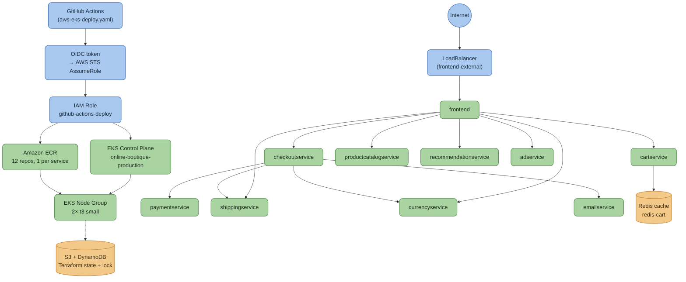

# Online Boutique — Production AWS EKS Deployment

> A production-grade AWS DevOps layer (Terraform, EKS, ECR, Helm, GitHub Actions OIDC CI/CD) built on top of Google's Online Boutique microservices demo.


---

## Table of Contents

- [Project Description](#project-description)
- [Attribution](#attribution)
- [Architecture](#architecture)
- [Tech Stack](#tech-stack)
- [Microservices](#microservices)
- [Prerequisites](#prerequisites)
- [How to Deploy](#how-to-deploy)
- [Project Structure (AWS layer)](#project-structure-aws-layer)
- [Cost Notes](#cost-notes)
- [What This Teaches](#what-this-teaches)
- [Challenges](#challenges)
- [Cleanup](#cleanup)
- [GCP Path (original, untouched)](#gcp-path-original-untouched)

---

## Project Description

This repo takes Google's **Online Boutique** — an 11-service gRPC microservices e-commerce demo in Go, C#, Node.js, Python, and Java — and adds a full production AWS deployment layer around it, without touching a single line of application code.

Everything under `terraform-aws/`, `addons/`, `kubernetes-manifests-aws/`, `helm-chart/values-aws-production.yaml`, and `.github/workflows/aws-eks-deploy.yaml` is new, purpose-built infrastructure-as-code. The original GCP/GKE deployment assets (`terraform/`, `kubernetes-manifests/`, `helm-chart/templates/`) ship unmodified alongside it, so both cloud targets coexist in the same repo.

Built and verified end-to-end on a real AWS account: VPC → EKS cluster → ECR → Helm release → 11/11 pods `Running`, reachable via a live frontend URL (plain Kubernetes `LoadBalancer` Service — no ALB Ingress installed this run, see [Architecture](#architecture)).

---

## Attribution

The application source (`src/*`) and the original GCP/GKE deployment assets are from Google's [**GoogleCloudPlatform/microservices-demo**](https://github.com/GoogleCloudPlatform/microservices-demo) ("Online Boutique"), licensed under [Apache License 2.0](LICENSE). No application code was modified to build this AWS layer.

Only the DevOps/infrastructure layer described in this README is original work added on top.

---

## Architecture



### How this flows

**Deploy path (blue nodes):** a push to `main` triggers GitHub Actions (`aws-eks-deploy.yaml`), which requests a short-lived OIDC token and exchanges it with AWS STS for temporary credentials — no stored AWS keys anywhere in GitHub Secrets. Those credentials assume the `github-actions-deploy` IAM role, which is scoped to two things: pushing built images to ECR, and deploying to the EKS control plane.

**Traffic path (green nodes):** a request hits the `frontend-external` LoadBalancer — a plain Kubernetes `LoadBalancer` Service, not an ALB Ingress (the ALB controller add-on is provisioned but not installed this run) — and lands on the `frontend` pod. From there: `frontend` fans out to `cartservice` (which reads/writes the Redis cache), `checkoutservice` (which itself calls `paymentservice`, `shippingservice`, `currencyservice`, and `emailservice` to complete an order), plus direct calls to `productcatalogservice`, `recommendationservice`, and `adservice`.

**Compute + registry (green nodes, background):** the EKS node group (2× `t3.small`) is what actually runs all 11 pods — the control plane only makes scheduling decisions, it doesn't host workloads itself. Every image running on those nodes was pulled from one of the 12 ECR repositories, one per service.

**State (amber nodes):** Terraform's own state — the record of what it created — lives in S3 with a DynamoDB lock table, so two people can't `apply` at the same time and corrupt it. This is provisioned by a separate one-time `bootstrap/` step before the main infrastructure apply can even run.

---

## Tech Stack

| Technology | Role |
|---|---|
| Terraform (>= 1.6, `hashicorp/aws` ~> 5.0) | VPC, EKS, ECR, IAM/IRSA, S3+DynamoDB remote state |
| Amazon EKS (1.30) | Managed Kubernetes control plane, `online-boutique-production` |
| Amazon ECR | 12 private image repos, one per microservice, lifecycle policies |
| Amazon VPC | 3-AZ public/private subnets, NAT gateway, IGW |
| IAM Roles for Service Accounts (IRSA) | Scoped AWS access per Kubernetes ServiceAccount, no node-wide IAM |
| GitHub Actions + OIDC | Build/push/deploy pipeline, no long-lived AWS keys in CI |
| Helm 3 | Chart-based deploy, `values-aws-production.yaml` overlay on the existing chart |
| Docker (multi-stage) | Per-service builds, existing Dockerfiles reused as-is |
| aws-load-balancer-controller / ExternalDNS / Cluster Autoscaler | Optional add-ons for ALB ingress, Route53 automation, node autoscaling |

---

## Microservices

| Service | Language |
|---|---|
| frontend | Go |
| cartservice | C# |
| productcatalogservice | Go |
| currencyservice | Node.js |
| paymentservice | Node.js |
| shippingservice | Go |
| emailservice | Python |
| checkoutservice | Go |
| recommendationservice | Python |
| adservice | Java |
| loadgenerator | Python/Locust |
| shoppingassistantservice | Python (optional, Gemini-powered) |

All communicate over gRPC; contracts live in `protos/`.

---

## Prerequisites

- AWS account with permissions to create VPC/EKS/IAM/ECR/S3/DynamoDB resources
- [Terraform](https://developer.hashicorp.com/terraform) >= 1.6
- [AWS CLI](https://aws.amazon.com/cli/) v2, configured
- [kubectl](https://kubernetes.io/docs/tasks/tools/) >= 1.30
- [Helm](https://helm.sh/) >= 3.15
- [Docker](https://www.docker.com/) for building/pushing images
- A GitHub repo with OIDC federation (default on github.com) if using the CI workflow

---

## How to Deploy

**1. Bootstrap the Terraform state backend (one time)**
```bash
cd terraform-aws/bootstrap
terraform init
terraform apply
terraform output   # note state_bucket / lock_table, copy into ../backend.tf
```

**2. Provision VPC, EKS, ECR, IAM/IRSA**
```bash
cd terraform-aws
cp terraform.tfvars.example terraform.tfvars
# edit: aws_account_id, github_repository, node sizing
terraform init
terraform plan -out=tfplan
terraform apply "tfplan"
```

**3. Point kubectl at the cluster**
```bash
aws eks update-kubeconfig --region us-east-1 --name online-boutique-production
kubectl get nodes
```

**4. Build and push all 12 images to ECR**
```bash
aws ecr get-login-password --region us-east-1 | \
  docker login --username AWS --password-stdin <AWS_ACCOUNT_ID>.dkr.ecr.us-east-1.amazonaws.com

for svc in adservice cartservice checkoutservice currencyservice emailservice \
           frontend loadgenerator paymentservice productcatalogservice \
           recommendationservice shippingservice shoppingassistantservice; do
  ctx="src/$svc"; [ "$svc" = "cartservice" ] && ctx="src/$svc/src"
  docker build -t <AWS_ACCOUNT_ID>.dkr.ecr.us-east-1.amazonaws.com/$svc:latest "$ctx"
  docker push <AWS_ACCOUNT_ID>.dkr.ecr.us-east-1.amazonaws.com/$svc:latest
done
```
(`.github/workflows/aws-eks-deploy.yaml` does this automatically per push, via OIDC — no stored AWS keys.)

**5. Deploy with Helm**
```bash
helm upgrade --install online-boutique helm-chart/ \
  -f helm-chart/values.yaml \
  -f helm-chart/values-aws-production.yaml \
  --set images.tag=latest \
  --set frontend.externalService=true \
  --namespace online-boutique --create-namespace
```
`values-aws-production.yaml` defaults to ALB-mode (`externalService: false`), which requires the aws-load-balancer-controller add-on to be installed (see the "Optional — ALB Ingress" note below). The `--set frontend.externalService=true` override above gets you a plain `LoadBalancer` Service instead — no add-on install required, matches the actual verified deploy this README describes.

**6. Get the frontend URL**
```bash
kubectl get svc frontend-external -n online-boutique
# open http://<EXTERNAL-IP> in a browser
```

**Optional — ALB Ingress + ExternalDNS + Cluster Autoscaler add-ons** (needs a Route53 domain + ACM cert): see manifests/values under `addons/`.

---

## Project Structure (AWS layer)

```
terraform-aws/
├── bootstrap/                    # S3 + DynamoDB state backend (run once, first)
├── vpc.tf, eks.tf, ecr.tf, iam.tf, backend.tf, variables.tf, outputs.tf
└── terraform.tfvars.example      # copy to terraform.tfvars, fill in real values

helm-chart/
└── values-aws-production.yaml    # ECR image repo, IRSA annotations, resource limits — overlay only

kubernetes-manifests-aws/
├── namespace.yaml, configmap-aws-config.yaml, secret-example.yaml
├── hpa.yaml                      # HorizontalPodAutoscalers
└── node-affinity-patch.yaml

addons/
├── aws-load-balancer-controller/ # IRSA serviceaccount, values, frontend Ingress
├── external-dns/                 # IRSA serviceaccount, deployment
└── cluster-autoscaler/           # IRSA serviceaccount, deployment

.github/workflows/
└── aws-eks-deploy.yaml           # matrix build/push to ECR (OIDC) + helm upgrade --install
```

---

## Cost Notes

- **EKS control plane**: flat $0.10/hr, no free tier
- **Node group**: sized to `t3.small` (free-tier-eligible instance class) — accounts restricted to free-tier instance types will reject larger types like `t3.medium`/`m6i.large` at launch
- **NAT gateway**: single NAT (not 3) to cut cost for demo/non-HA use
- Rough total: **~$0.20–0.25/hr** running, effectively **$0** once `terraform destroy` is run
- Recommended workflow: `apply` → verify/demo → `destroy`, rather than leaving the cluster up

---

## What This Teaches

| What Was Built | Skill Demonstrated |
|---|---|
| VPC + EKS + ECR + IAM/IRSA in Terraform | AWS infrastructure-as-code from scratch |
| IRSA roles per add-on (ALB controller, ExternalDNS, Cluster Autoscaler) | Least-privilege AWS access from Kubernetes, no node-wide IAM |
| GitHub Actions OIDC → AWS role assumption | Keyless CI/CD, no long-lived cloud credentials |
| Helm overlay pattern (`-f base -f production`) | Layering environment-specific config without forking a chart |
| Remote state bootstrap (S3 + DynamoDB, chicken-and-egg problem) | Terraform backend design constraints |
| Free-tier / account-restriction debugging | Reading AWS API errors (`AsgInstanceLaunchFailures`) and adjusting instance types live |
| TLS interception debugging (AV Web Shield breaking loopback gRPC) | Diagnosing local dev-environment network issues, not just cloud issues |

---

## Challenges

- **Corporate/local AV HTTPS scanning broke Terraform.** AVG's Web Shield intercepted loopback TLS between Terraform core and its provider plugin (`x509: certificate signed by unknown authority` on a *local* gRPC handshake). Fixed by temporarily disabling HTTPS scanning during `plan`/`apply`.
- **AWS CLI/Terraform SSL errors from corp network TLS interception.** `SSL_CERT_FILE`/`AWS_CA_BUNDLE` pointed at a PEM built from the Windows trusted-root cert store resolved it.
- **Node group `CREATE_FAILED`: `t3.medium` rejected.** `AsgInstanceLaunchFailures: ... not eligible for Free Tier`. The AWS account was restricted to free-tier instance types only. Switched to `t3.small` (free-tier eligible, 2 vCPU/2GB — still enough for all 11 lightweight services) and re-applied only the node group.

---

## Cleanup

```bash
cd terraform-aws && terraform destroy
cd bootstrap && terraform destroy   # only if you're fully done — this deletes remote state
```

---

## GCP Path (original, untouched)

Google's original GKE/GCP deployment path — `kubernetes-manifests/`, `helm-chart/templates/` (base), `terraform/` (GKE + Memorystore), `kustomize/`, `skaffold.yaml` — ships unmodified in this repo. See [`docs/development-guide.md`](docs/development-guide.md) for that quickstart.

---

**License:** Application code is Apache 2.0, © Google LLC — see [LICENSE](LICENSE). AWS infrastructure code added in this repo follows the same license unless noted otherwise.
